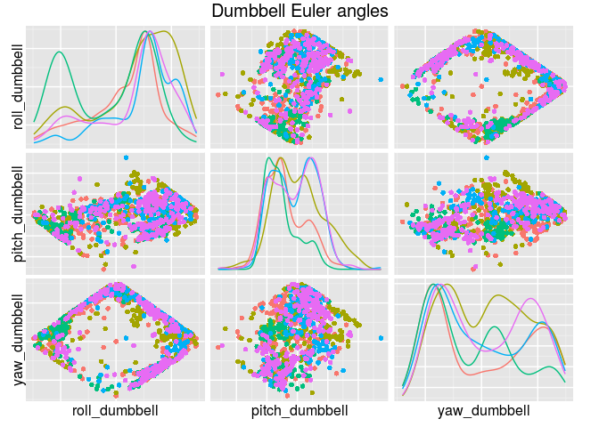

# Prediction Assignment

*Yasser Gonzalez – http://yassergonzalez.com*<br>
*September 2015*

# Introduction

The goal of this assignment is to build a model capable of identifying
if a subject is performing a specific weight lifting exercise correctly.
A data set is available with information collected from six subjects
who were asked to perform 10 repetitions of dumbbell lifts in five
different settings:

1.   exactly according to the specification (class `A`),
2.   throwing the elbows to the front (class `B`),
3.   lifting the dumbbell only halfway (class `C`),
4.   lowering the dumbbell only halfway (class `D`), and
5.   throwing the hips to the front (class `E`).

The model's input consists of a number of sensors attached to the body
of the subject: on the belt, forearm, arm, and dumbbell. Using this
information, the model must provide a decision about the correctness
of the exercise execution according to one of the five categories
specified above.

Additional information about the experimental setup and the data set
is available at http://groupware.les.inf.puc-rio.br/har and in the
following publication:

> Velloso, E.; Bulling, A.; Gellersen, H.; Ugulino, W.; Fuks, H.
> [Qualitative Activity Recognition of Weight Lifting Exercises. ](http://groupware.les.inf.puc-rio.br/work.jsf?p1=11201)
> *4th International Conference in Cooperation with SIGCHI (Augmented Human '13)*.
> Stuttgart, Germany: ACM SIGCHI, 2013.

# Initialization

The following code loads the required R packages and sets the random
seed to ease the reproducibility of the results.


```r
library("readr")
library("dplyr")
library("magrittr")
library("GGally")
library("caret")
library("randomForest")
library("doMC")

set.seed(2100479551)
```

# Data Loading and Feature Selection

First, the data set is downloaded and loaded into R.


```r
dataset_url <- "https://d396qusza40orc.cloudfront.net/predmachlearn/pml-training.csv"
dataset_csv <- "pml-training.csv"
if (!file.exists(dataset_csv)) {
    download.file(dataset_url, dataset_csv, method = "curl")
}
dataset <- read_csv(dataset_csv)
```

In addition to the different readings from the sensors, the data set
includes a number of engineered features (such as mean and standard
deviation of the sensor readings computed over a certain sliding time
window), but for this assignment I have decided to work with the
original sensor readings. Therefore, the selected features correspond
to the Euler angles (roll, pitch and yaw), and the 3-axis coordinates
of the accelerometer, gyroscope and magnetometer readings for each one
of the four sensors.


```r
sensors <- c("forearm", "arm", "belt", "dumbbell")
vars <- c("roll_%s", "pitch_%s", "yaw_%s",
          "gyros_%s_x", "gyros_%s_y", "gyros_%s_z",
          "accel_%s_x", "accel_%s_y", "accel_%s_z",
          "magnet_%s_x", "magnet_%s_y", "magnet_%s_z")
features <- unlist(lapply(sensors,
      function (sensor) lapply(vars,
               function (var) sprintf(var, sensor))))

dataset <- dataset %>%
    select(one_of(c("classe", features))) %>%
    mutate(classe = as.factor(classe))
```

There are 19622 samples of the 48
features in the data set. Before continuing, the data set is divided
in two parts: 80% of the available samples will be used to train the
model and the remaining 20% for testing. The testing portion of the
data set will be used to estimate the out-of-sample accuracy of the
model.


```r
indices <- createDataPartition(dataset$classe, p = 0.8, list = FALSE)
training_data <- dataset[indices, ]
testing_data <- dataset[-indices, ]
```

The training data set has 15699 samples and the
training data set 3923.

# Building the Model

An initial exploratory analysis showed that the classes does not seem
linearly separable, and the variable distributions depart considerably
from the normal distribution. The plot shown below illustrates some of
these characteristics for a sample of the variables corresponding to
the Euler angles of the dumbbell sensor.



Considering these characteristics and the main goal of having accurate
predictions, I decided to use random forests to build the model. The
following code fragment builds a random forest with 500 trees on the
training portion of the data, using 10-fold cross validation with
accuracy as the evaluation metric to select the other model parameters
(i.e. `mtry`).


```r
model_file <- "model.rds"
if (!file.exists(model_file)) {
    registerDoMC(cores = 4)
    model <- train(classe ~ ., data = training_data,
                   method = "rf",
                   tuneLength = 8, # number of mtry values
                   metric = "Accuracy",
                   trControl = trainControl(method = "cv", number = 10))
    saveRDS(model, model_file)
} else {
    model <- readRDS(model_file)
}
```

The construction of the random forest took 36
minutes using 4 processes on an Intel(R) Core(TM) i5-4200M CPU at 2.50 GHz
with 8 GB of RAM. The final model was 99.5%
accurate on the training sample. In the next section, the out-of-sample
accuracy is estimated on the testing portion of the data set.

# Evaluating the Model

The following code evaluates the performance of the constructed model
on the testing portion of the data set.


```r
confusionMatrix(predict(model, newdata = testing_data),
                testing_data$classe)
```

```
## Confusion Matrix and Statistics
##
##           Reference
## Prediction    A    B    C    D    E
##          A 1116    0    0    0    0
##          B    0  759    2    0    0
##          C    0    0  680    5    0
##          D    0    0    2  638    1
##          E    0    0    0    0  720
##
## Overall Statistics
##
##                Accuracy : 0.9975
##                  95% CI : (0.9953, 0.9988)
##     No Information Rate : 0.2845
##     P-Value [Acc > NIR] : < 2.2e-16
##
##                   Kappa : 0.9968
##  Mcnemar's Test P-Value : NA
##
## Statistics by Class:
##
##                      Class: A Class: B Class: C Class: D Class: E
## Sensitivity            1.0000   1.0000   0.9942   0.9922   0.9986
## Specificity            1.0000   0.9994   0.9985   0.9991   1.0000
## Pos Pred Value         1.0000   0.9974   0.9927   0.9953   1.0000
## Neg Pred Value         1.0000   1.0000   0.9988   0.9985   0.9997
## Prevalence             0.2845   0.1935   0.1744   0.1639   0.1838
## Detection Rate         0.2845   0.1935   0.1733   0.1626   0.1835
## Detection Prevalence   0.2845   0.1940   0.1746   0.1634   0.1835
## Balanced Accuracy      1.0000   0.9997   0.9963   0.9957   0.9993
```

The model obtained an accuracy of
99.7%
on the testing sample. This value constitutes an estimation of the
out-of-sample accuracy, given that this sample was not used in any way
during the construction of the model. Given the highly accurate
results, it is reasonable to expect that the model will perform well
on unseen data.

# Submission Results

Finally, the following code computes the predictions for the
evaluation sample of the assignment. All the predicted values were
correct.


```r
testing_dataset_url <- "https://d396qusza40orc.cloudfront.net/predmachlearn/pml-testing.csv"
testing_dataset_csv <- "pml-testing.csv"
if (!file.exists(testing_dataset_csv)) {
    download.file(testing_dataset_url, testing_dataset_csv, method = "curl")
}

testing_dataset <- read_csv(testing_dataset_csv) %>%
    select(one_of(c("problem_id", features)))

results <- predict(model, newdata = testing_dataset)

for (i in seq(along = results)) {
    txt_file <- paste0("problem_id_", testing_dataset$problem_id[i], ".txt")
    write.table(results[i], file = txt_file,
                quote = FALSE, row.names = FALSE, col.names = FALSE)
}

results
```

```
##  [1] B A B A A E D B A A B C B A E E A B B B
## Levels: A B C D E
```
